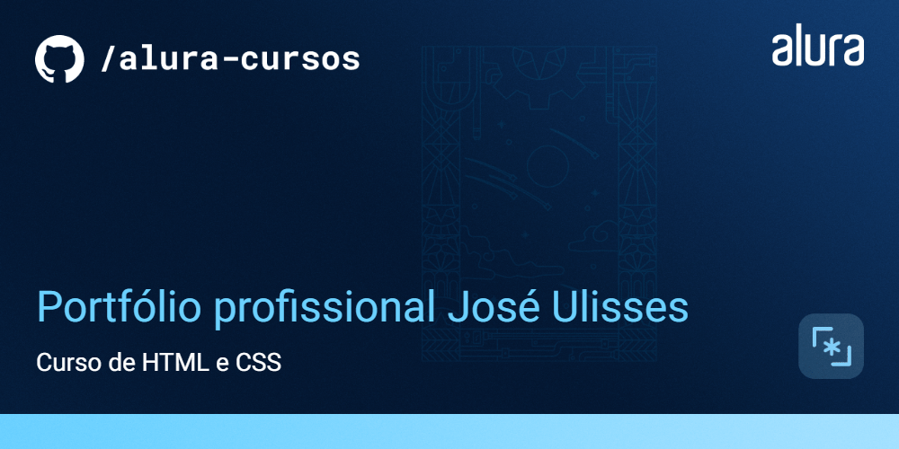

# Orgs

Portfólio profissional desenvolvido durante o curso de HTML e CSS na Alura, com o intuito de apresentar as experiências de trabalho, e tecnologias que domino e tenho estudado.

## 🔨 Funcionalidades do projeto

O projeto apresenta uma breve descrição sobre mim, juntamente com as formações e experiencias que tenho, como também apresenta alguns projetos desenvolvidos por mim.

## ✔️ Técnicas e tecnologias utilizadas

As técnicas e tecnologias utilizadas pra isso são:

- `Mobile first`: criação de projetos web e sites primeiro em dispositivos móveis
- `ConstraintLayout`: ViewGroup padrão para implementar todos os layouts
- `Coil`: carregar imagens via requisição HTTP
- `View Binding`: busca de views do layout de forma segura
- `Fontes personalizadas`: configuração para adicionar novas fontes
- `Personalização de tema`: modificação de cores para o tema do App
- `HTML`: Linguagem de Marcação de HiperTexto
- `CSS`: Cascading Style Sheets ou Folhas de Estilo em Cascata

## 🎯 Desafio

Tela de detalhes do produto

## 📁 Acesso ao projeto

Você pode [acessar o código fonte do projeto inicial](https://github.com/Joseulisses065/Portifolio-HTML-e-CSS-Curso-alura)

## 🛠️ Abrir e rodar o projeto

No link abaixo você pode acessar meu portfólio:

[Acessar portfólio](https://portifolio-silk-chi.vercel.app/curriculo.html)